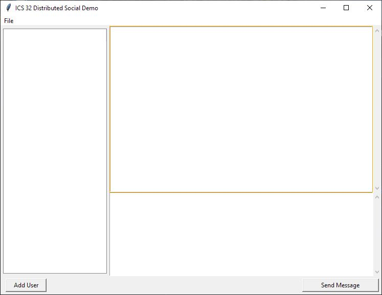

How to Operate Program:

STEPS:

1. Run gui.py.

    Gui.py is the driver for the program. When ran, it will display a window with three different empty areas, an add user button, a send message button, and the ability to open and create new dsu files. The left most area will display your contacts for messaging, the bottom panel will be the INPUT area where you will write your messages, and the top panel is where the messages will appear.

2. Choose to either to create a NEW file or OPEN an existing file using the File menu button at the top of the window (on Windows systems) or at the top of the screen in the finder bar (on Mac). 

    If you choose to create a new file, you will be prompted to save 
    the file in the location of the program, and then a popup window
    will appear to input a username and password. If the fields are left
    blank after the Submit button is presssed, a default username and
    password will be assigned to you.

    If you choose to open a file, simply find the .dsu file in your system and load it normally.

3. Send/recieve Messages

    Once you have an active file open, it's time to send and recieve some messages. Click the Add User button and notice the popup window that prompts you for a recipient username. Type in the username you would like to chat with and click the Add Contact button in the popup window. The contact username will appear in the left panel. Click on the username in the panel to select it, and then type your message in the bottom text area. Click the Send Message button when complete. Notice the message appear in the chat viewing area.

    To recieve a message, someone would need to add you as a contact and send the message in the same way as explained above. Even if you do not have the sender in your contacts, you will notice their username show up in the left contacts panel when you recieve their first message to you. Click on their username to see your chat history with them. Send one back by simply typing into the bottom message panel and click "Send Message" like mentioned before.

